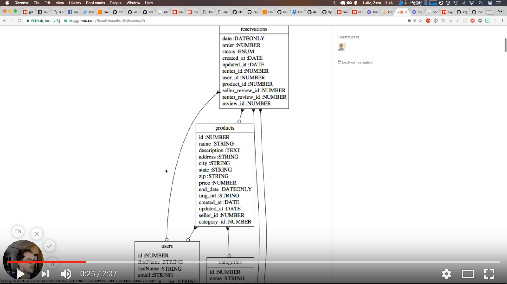

# Code Review Starter

First of all, this is all hacky as hell (HaH). Use at your own risk.

[](https://www.youtube.com/watch?v=gp89_G8N1EI)

If you clone this repo, you can run

```bash
$ npm start -- https://path/to/some/student/bones/project
```

Check out example output [here](./example.md).

And it will do a bunch of stuff:

- Clone that project into a `./.tmp/{currentunixdate}` directory
- `yarn install`
- Run [`npm-check`](https://www.npmjs.com/package/npm-check) with specailly configured output for packages they've installed but aren't using
- Use [zekenie/sequelize-erd](https://github.com/zekenie/sequelize-erd) to generate an ERD diagram located at `./.tmp/{currentunixdate}/ERD.png`
- Generate a bar graph of where they wrote most of their code
- Run all files through a linter, producing lists of errors, plus space for human comment on files
- Show a crude representation of their express route tree

Poke around in `index.js`. You'll see an object called `directories` that specifies where its looking. Currently hard coded to bones.

